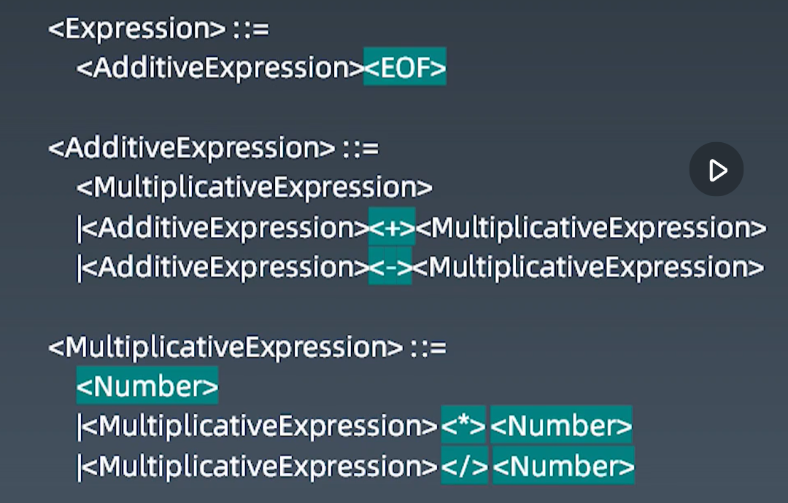

# 第三周学习笔记

> 我们的代码在计算机的分析过程：
>
> ```mermaid
> graph LR;
>    1.词法分析 --> 2.语法分析 --> 3.解析;
> ```
>
> 第 2 步中的语法分析又是一个构建语法树的过程，最著名的语法分析算法的核心思想有两种：
>
> - LL 算法：[编译原理 LL(1)详解](https://www.cnblogs.com/yuanting0505/p/3761411.html)
> - LR 算法：[语法分析算法 LR(1)基础教程](https://blog.csdn.net/u014287775/article/details/56014810)

## LL 算法

从左向右扫描输入，然后产生最左推导(就是每次都把最左边的非终结字符用产生式代替)。

### 四则运算

#### 词法分析

- TokenNumber： 0~9、**.** (允许小数点的组合)
- Operator: + - \* /
- Whitespace: `<SP>`
- LineTerminator: `<LF>`、`<CR>`

#### 语法分析



一共分为三部分：

- 产生式： 在计算机中指 Tiger 编译器将源程序经过词法分析（Lexical Analysis）和语法分析（Syntax Analysis）后得到的一系列符合文法规则（Backus-Naur Form，BNF）的语句

- 终结符（TerminalSymbol）：Number、+、-、\*、/、EOF（End Of File）
- 非终结符（NoneTerminalSymbol）：AdditiveExpression、MultiplicativeExpression

1. **Expression**
   1. `<AdditiveExpression><EOF>`
2. **AdditiveExpression**
   1. `<MultiplicativeExpression>`
   2. `<AdditiveExpression> < + > <MuliplicativeExpression>`
   3. `<AdditiveExpression> < - > <MuliplicativeExpression>`
3. **MultiplicativeExpression**
   1. `<Number>`
   2. `<MuliplicativeExpression> < * > <Number>`
   3. `<MuliplicativeExpression> < / > <Number>`

## Tips

- `reg.exec(string)`:
  > 1.  对参数 String 字符串进行匹配，返回值是一个数组，如果没有相应的匹配值则返回 null。返回值的数组的第 0 个元素就是与正则表达式匹配的文本，第 1 个元素就是第一个子表达式相匹配的文本（如果有的话）
  > 2.  该方法在匹配到相应值后，会把正则对象的 lastIndex 属性指定为匹配到的元素下标的下一个位置，下次再进行匹配将会从 lastIndex 处开始。（我理解的就相当于把之前已经匹配过的字符串删掉，或者说忽略掉，这也正是我们可以通过不断的循环来进行匹配的原因。）

* 当正则表达式用`或（|）`分隔符分割开的时候，每次匹配之会匹配到其中的一个分支里去，所以在代码里我们需要通过 while 去循环匹配
